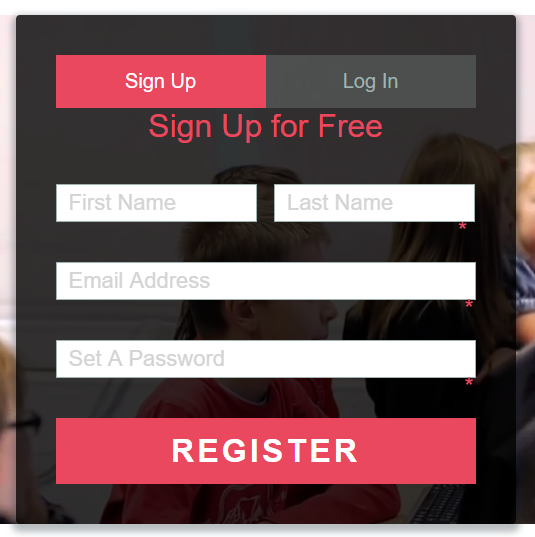

# 🔐 Login-Sign-Up System

A simple and secure **user authentication system** built with **PHP**, **MySQL**, and **JavaScript**. Includes full functionality for login, sign-up, logout, password reset, and email verification.

---

## 📸 Screenshots

### 🔑 Login Page

### 📝 Sign-Up Page

---

## 💡 Features

- 🔐 Secure Login & Sign-Up
- 📧 Email Verification
- 🔁 Forgot Password Functionality
- 🚪 Logout System
- ✅ Front-end Validation with jQuery
- 📦 Clean and structured file organization

---

## 🛠️ Technologies Used

- **PHP** – Backend scripting
- **MySQL** – Database
- **JavaScript / jQuery** – Client-side interactivity
- **HTML5 & CSS3** – Frontend design
- **Cloudflare CDN** – jQuery (via: `http://cdnjs.cloudflare.com/ajax/libs/jquery/2.1.3/jquery.min.js`)
